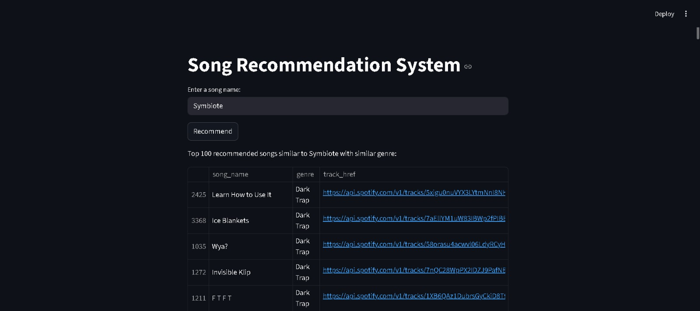

# 🎵 Music Recommendation System

A **Streamlit-based Music Recommendation System** that suggests songs based on similar genres using a Spotify dataset.

This project demonstrates how data analysis and simple recommendation logic can be used to suggest songs to users. It is designed as a beginner-friendly machine learning and data analytics project.

---

# 📌 Project Overview

Music streaming platforms recommend songs based on listening patterns, genres, and user behavior.

This project builds a simplified recommendation system that:

* Takes a song name as input
* Finds its genre from the dataset
* Recommends other songs from the same genre
* Displays up to **100 similar songs**

The project is built using **Python, Pandas, and Streamlit** to create an interactive interface.

---

# 🚀 Features

✔ Enter a song name to get recommendations
✔ Displays **Top 100 similar songs**
✔ Uses **genre-based filtering**
✔ Interactive web interface built with **Streamlit**
✔ Displays song name, genre, and Spotify track link

---

# 🖥️ Application Screenshot



---

# 🛠️ Technologies Used

* **Python**
* **Streamlit**
* **Pandas**
* **Machine Learning Concepts**
* **Spotify Dataset**

---

# 📊 Dataset

The project uses a **Spotify songs dataset** that contains the following features:

* `song_name` – Name of the song
* `genre` – Music genre
* `track_href` – Spotify track API link

The dataset is stored in:

```
spotify_dataset.csv
```

---

# ⚙️ Installation & Setup

### 1️⃣ Clone the repository

```
git clone https://github.com/awschavan/Music-Recommendation-System---project-1-.git
```

### 2️⃣ Navigate to the project folder

```
cd Music-Recommendation-System---project-1-
```

### 3️⃣ Install required libraries

```
pip install streamlit pandas
```

### 4️⃣ Run the application

```
streamlit run App.py
```

---

# 📈 How the Recommendation Works

The recommendation logic works as follows:

1. User enters a **song name**
2. The program searches for the song in the dataset
3. It retrieves the **genre of the selected song**
4. It finds other songs with the **same genre**
5. It randomly selects **100 songs from that genre**
6. Displays them in a table with Spotify links

---

# 📂 Project Structure

```
Music-Recommendation-System
│
├── App.py
├── spotify_dataset.csv
├── Music Recommendation Project.ipynb
├── README.md
├── song_recommendation_dashboard.jpeg
```

---

# 🎯 Future Improvements

Possible improvements for this project:

* Add **album cover images**
* Add **audio preview for songs**
* Use **content-based filtering**
* Use **collaborative filtering**
* Deploy the project online

---

# 👨‍💻 Author

**Swapnil Chavan**
Aspiring Data Analyst

GitHub:
https://github.com/awschavan

---

⭐ If you like this project, please consider giving it a **star**.
